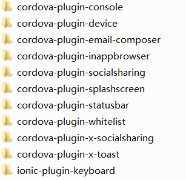

# 开心云日记
<h2>一款日记本，用angularJs和ionic制作，可以用Cordova打包为安卓、ios应用。<a href="https://github.com/jakeyChen1994/happy-notebook/raw/master/ionicNoteBook.apk">点击下载</a>apk文件</h2>

说明：

<h2>命令行安装</h2>

首先您需要安装 <a href="https://nodejs.org/en/">Node.js</a>，接下来的安装中需要使用到其 NPM 工具，更多 NPM 介绍可以查看<a href="https://www.npmjs.com/">NPM 使用介绍</a>。

然后通过<a href="https://npmjs.org/package/ionic" target="_blank">命令行工具</a>安装最新版本的 cordova 和 ionic 。通过参考<a href="http://cordova.apache.org/docs/en/latest/guide/platforms/android/index.html" target="_blank">Android</a> 和 <a href="http://cordova.apache.org/docs/en/latest/guide/platforms/ios/index.html" target="_blank">iOS</a> 官方文档来安装。

Window 和 Linux 上打开命令行工具执行以下命令：

<pre>
$ npm install -g cordova ionic
</pre>

Mac 系统上使用以下命令：

<pre>
sudo npm install -g cordova ionic
</pre>

<i>
  提示: IOS需要在Mac Os X. 和Xcode环境下面安装使用。
</i>

如果你已经安装了以上环境，可以执行以下命令来更新版本:

<pre>
npm update -g cordova ionic
</pre>

或

<pre>
sudo npm update -g cordova ionic
</pre>
<h3>创建应用</h3>

使用ionic官方提供的现成的应用程序模板，或一个空白的项目创建一个ionic应用：

<pre>
$ ionic start myApp tabs
</pre>

<h3>运行我们刚才创建的ionic项目</h3>

使用 ionic tool 创建，测试，运行你的apps(或者通过Cordova直接创建)。

<h3>创建Android应用</h3>
<pre>
$ cd myApp
$ ionic platform add android
$ ionic build android
$ ionic emulate android
</pre>
<h3>创建iOS应用</h3>
<pre>
$ cd myApp
$ ionic platform add ios
$ ionic build ios
$ ionic emulate ios
</pre>

<blockquote>

如果出现"ios-sim was not found."错误，可以执行以下命令：

<pre>npm install -g ios-sim</pre>
</blockquote>

<h3>插件安装</h3>

如何安装cordova插件请参考<a href="http://cordova.apache.org/plugins/faq.html" target="_blank">cordova插件安装帮助</a>

安卓平台上需要安装的插件如下
 

<a href="https://github.com/jakeyChen1994/happy-notebook/raw/master/ionicNoteBook.apk">点击下载</a>已经打包完成的apk
